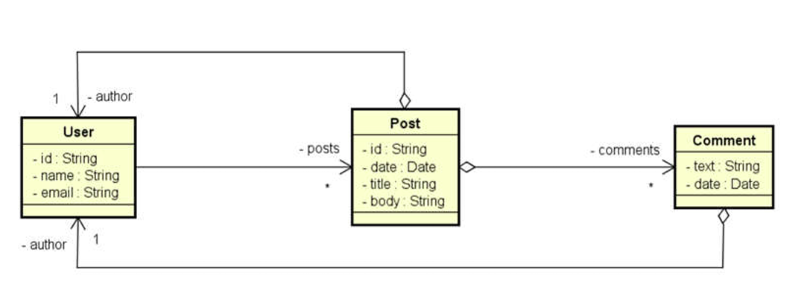

# 🧩 Workshop Spring Boot com MongoDB

Este projeto é uma API RESTful construída com **Spring Boot** e **MongoDB**. O objetivo é demonstrar como integrar o MongoDB em uma aplicação Java utilizando Spring Data, com foco em operações CRUD, consultas simples e relacionamentos entre documentos.

---

## 🧪 Tecnologias utilizadas

- Java 21
- Spring Boot
- Spring Data MongoDB
- MongoDB
- Maven

---

## 🧠 Diagrama da Modelagem de Dados

Abaixo, uma representação visual das entidades e seus relacionamentos:



## 📚 Modelagem de Dados

A aplicação trabalha com três principais documentos:

- **User**: Representa o usuário da plataforma.
- **Post**: Representa uma postagem feita por um usuário.
- **Comment**: Representa um comentário feito em uma postagem.

### 🔗 Relacionamentos

- Um `User` pode ter vários `Post`s.
- Um `Post` contém um autor (dados resumidos do `User`) e uma lista de `Comment`s.
- Cada `Comment` também possui um autor embutido.

📌 Os dados são armazenados de forma **aninhada** (embed), aproveitando a estrutura flexível do MongoDB.

---

## 📂 Funcionalidades

### 🔄 CRUD completo de Usuários

- `GET /users` → Buscar todos os usuários  
- `GET /users/{id}` → Buscar um usuário por ID  
- `POST /users` → Adicionar novo usuário  
- `PUT /users/{id}` → Atualizar um usuário  
- `DELETE /users/{id}` → Deletar um usuário  

---

### 🔍 Operações com Posts

- `GET /posts` → Buscar todos os posts  
- `GET /posts/{id}` → Buscar um post por ID  

#### 🔎 Busca por título (Query Method)

```http
GET /posts/titlesearch?text=viagem
````

Utiliza:

```java
List<Post> findByTitleContainingIgnoreCase(String text);
```

#### 🔎 Busca por título com @Query

```http
GET /posts/search?text=viagem
```

Utiliza:

```java
@Query("{ 'title': { $regex: ?0, $options: 'i' } }")
List<Post> searchTitle(String text);
```

---

## 🖼️ Exemplo de estrutura de documentos

### 👤 User

```json
{
  "id": "1001",
  "name": "Maria Brown",
  "email": "maria@gmail.com",
  "posts": ["5001", "5010"]
}
```

### 📝 Post

```json
{
  "id": "5001",
  "title": "Partiu viagem",
  "body": "Vou viajar para São Paulo. Abraços!",
  "author": {
    "id": "1001",
    "name": "Maria Brown"
  },
  "comments": [
    {
      "text": "Boa viagem mano!",
      "date": "2018-03-21",
      "author": {
        "id": "1013",
        "name": "Alex Green"
      }
    }
  ]
}
```

---

## 🚀 Como executar o projeto

Certifique-se de que o MongoDB está rodando localmente na porta padrão (`localhost:27017`).

Clone este repositório:

```bash
git clone https://github.com/FernandoFreitas571/workshop-spring-boot-mongodb.git
cd workshop-spring-boot-mongodb
```

Execute a aplicação com Maven:

```bash
./mvnw spring-boot:run
```

Acesse: [http://localhost:8080](http://localhost:8080)

---

## 💡 Observações

* As entidades `AuthorDTO` e `CommentDTO` são usadas para evitar a serialização completa de documentos relacionados, mantendo apenas os dados essenciais.

* A base de dados pode ser populada com dados iniciais através do recurso `CommandLineRunner`.

---

## ✍️ Autor

Feito com 💻 por Fernando Freitas
